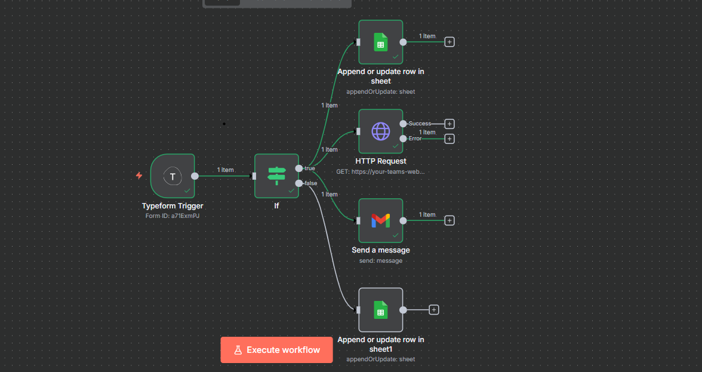

# README: n8n Lead Qualification & Notification Workflow

**Project by: Ankit**

This document provides a comprehensive overview of the n8n automation workflow designed to capture, qualify, and process new business leads.

---

### 1. Workflow Logic & Explanation

This workflow automates the entire lead management process, from the moment a potential client fills out a Typeform on the company website to the final data entry and team notification.

The automation follows these logical steps:

1.  **Trigger:** The workflow begins when a new lead submits their information through a **Typeform** form.

2.  **Lead Qualification:** The core of the workflow is a single **IF node** that evaluates each lead against a specific set of business rules to determine if they are qualified. The rule is:
    * `(Company Size ≥ 20 AND Budget > ₹1,00,000) OR (Country is not India)`
    * The implementation uses a single JavaScript expression to handle string-based inputs (e.g., "20-49") from the form's dropdown menus for Company Size and Budget.

3.  **Qualified Path (IF returns TRUE):** If a lead meets the criteria, the workflow performs the following actions in parallel:
    * **Set Status:** A **Set** node assigns a status of **"Qualified"** to the lead's data.
    * **Log to Google Sheets:** The lead's details and "Qualified" status are appended as a new row to a master Google Sheet for tracking.
    * **Notify Sales via Email:** An **Email** node sends a formatted alert to `sales@company.com` with all the lead's details.
    * **Notify Sales via Teams:** An **HTTP Request** node sends a formatted message card to a dedicated Microsoft Teams channel.

4.  **Not Qualified Path (IF returns FALSE):** If a lead does not meet the criteria:
    * **Set Status:** A **Set** node assigns a status of **"Not Qualified"**.
    * **Log to Google Sheets:** The lead's details and "Not Qualified" status are appended to the same master Google Sheet, ensuring all inquiries are recorded.

---

### 2. Tools & Services Used

* **n8n.io:** The core platform used for building and hosting the automation workflow.
* **Typeform:** The service used for lead capture via an online form.
* **Google Sheets:** Used as the central database for logging all incoming leads, both qualified and not.
* **Email (SMTP):** The protocol used by the Send Email node to dispatch notifications.
* **Microsoft Teams (via HTTP Request):** The communication platform for sales team alerts, integrated via an Incoming Webhook. The HTTP Request node was used to demonstrate this functionality due to potential account permission complexities with the dedicated Teams node.

---

### 3. Assumptions & Limitations

* **Assumptions:**
    * The workflow assumes the incoming Typeform data will have consistent fields (Name, Email, Company, Company Size, etc.).
    * It assumes that credentials for Google Sheets and an email service (SMTP) are correctly configured and stored within n8n.
    * The target Google Sheet is assumed to have pre-configured column headers.

* **Limitations:**
    * This version of the workflow does **not** include a mechanism to check for and prevent duplicate lead entries.
    * The Email and Microsoft Teams notification nodes are configured to demonstrate functionality. A live production environment would require verified credentials and webhook URLs.
    * Error handling is basic. A production-ready version would benefit from dedicated error branches to handle potential API failures or unexpected data formats.
